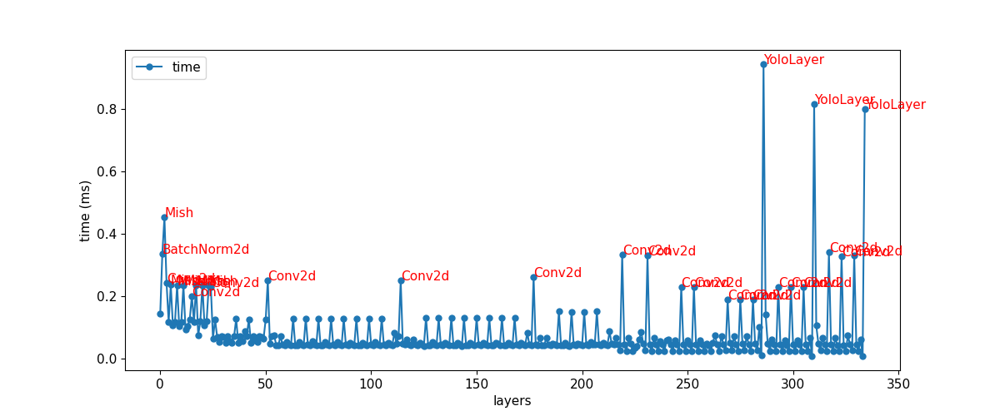
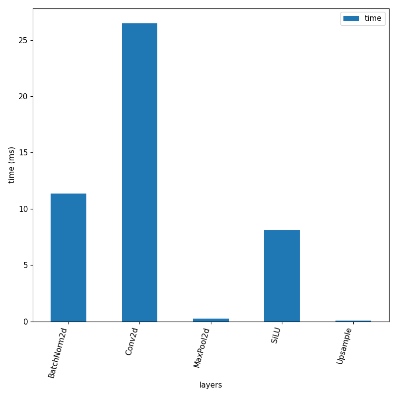
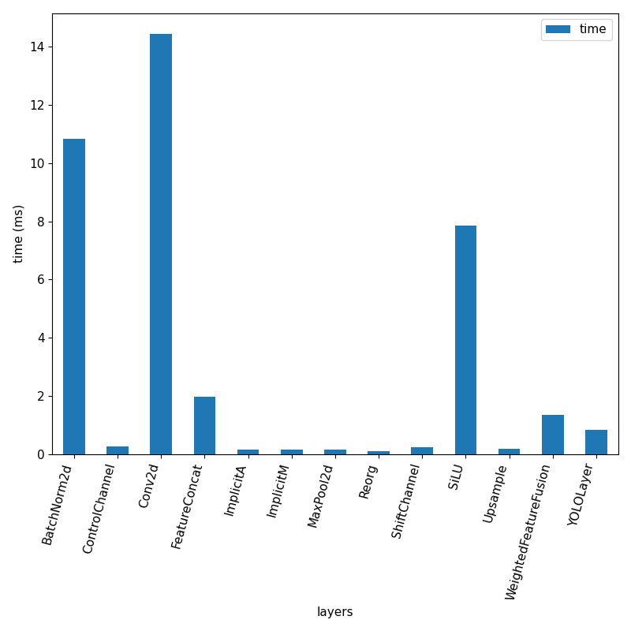
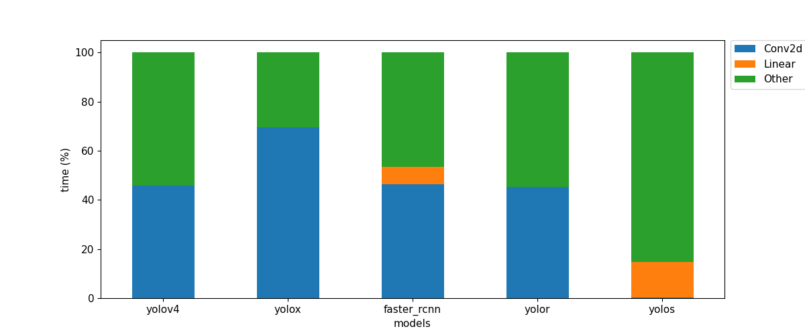

# Vision Models Profiling

## Todo
- [x] Build Per Layer Latency Profiler
- [x] Test on RTX 3090
- [ ] Test on Jetson Devices
- [ ] Build Memory Profiler
- [ ] Test on RTX 3090
- [ ] Test on Jetson Devices

## Per layer latency

### Faster RCNN

### YoloV4

### YoloX

### YoloR

### YoloS 

## Model Layer Comparison
### Faster RCNN

### YoloV4

### YoloX

### YoloR

### YoloS

## Model Comparison
